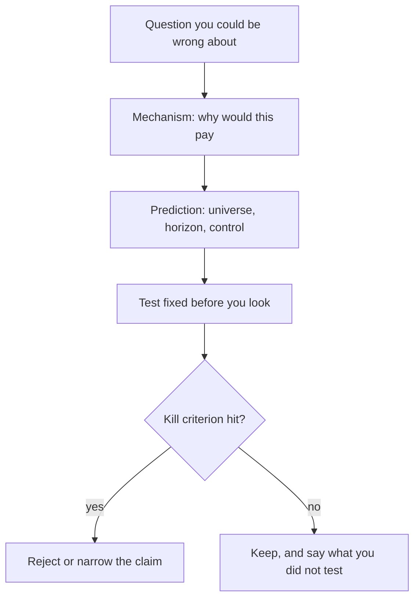

# Research question & hypothesis
{: .no_toc }

*~8 min read*

**Interview occasional**

## Why it matters

A backtest is not a research question. Interviewers can tell when a candidate found a curve and then invented a story for it. A usable hypothesis names a mechanism, a prediction that could be wrong, and the test you would accept as a rejection — before you look at the equity curve. The rest of this guide (data, factors, alpha, backtests) is how you don't lie to yourself while checking that prediction.

## Core concepts

- **Start from a mechanism, not a ticker.** Risk premia (you get paid to hold a risk others don't want), behavioral mistakes (slow reaction, overreaction, constraints), structural frictions (index flows, mandates, balance-sheet limits), and microstructure (inventory, tick size) are different reasons a pattern might exist. The reason changes the horizon, the universe, and what should kill the idea.
- **The null is boring on purpose.** "No incremental return after the risks and costs you claim to have controlled." Raw outperformance of the market is not a rejection of that null. See [Factor models](../04-factor-models/).
- **Write the prediction in a form you can fail.** "Cheap stocks outperform expensive stocks over the next year, after industry" is a prediction. "Markets are inefficient" is not. Include universe, signal date, holding horizon, and what "after" means.
- **Specification is part of the hypothesis.** Rebalance frequency, lag, neutralization, and the cost model are not decorations you add once the Sharpe looks good. Changing them after seeing results is a new test. See [Backtest pitfalls](../07-backtest-pitfalls/) and [Multiple testing](../08-statistical-significance-multiple-testing/).
- **Availability has to match the story.** If the mechanism is "investors underreact to filings," the signal cannot use a restated number or a filing that was not public yet. That constraint is a hypothesis check, not a data chore. See [Data hygiene](../02-data-hygiene-survivorship/).
- **A published factor is a baseline, not a crime.** Knowing that value or momentum exists does not make a new test invalid. Pretending your book is "alpha" when it is mostly that factor does. Say what is incremental.
- **Kill criteria up front.** Examples: the spread dies once you neutralize industry, the effect is one regime, turnover consumes the gross return, or the result needs a look-ahead fill. If you can't name a kill criterion, you are collecting charts.

## Mental model

Think of the hypothesis as the contract for the backtest. The backtest does not get to renegotiate the contract after it sees the curve.

## Interview questions

1. **You notice that stocks mentioned positively on social media outperform the next day. What do you need before you call that a hypothesis?**
   Answer: A mechanism (attention, slow diffusion, or just a size/momentum proxy), the decision time (what was public before the open you trade), the horizon, the universe, and the controls (market, momentum, liquidity). Plus a kill criterion: for example, the spread disappears after you skip names you could not have traded at the open, or after you neutralize recent returns.

2. **Why is "the strategy made money in the backtest, so the hypothesis is true" backwards?**
   Answer: The backtest is one look at one specification. It can pass because of leakage, survivorship, costs left at zero, or because you tried many variants. The hypothesis is the economic claim. The backtest is evidence about that claim only if the test matches the claim and you account for how many tests you ran.

3. **A PM asks you to "find something that works in small caps." What's wrong with that as a research question, and how do you rewrite it?**
   Answer: It has no mechanism and no failure mode, so any search over features will eventually fit the sample. Rewrite it as a specific friction (higher costs, less analyst coverage, slower incorporation of filings) with a prediction (stronger post-filing drift in names below a coverage threshold, net of a cost model that is harsher for small caps).

4. **When is it legitimate to change the hypothesis after seeing data?**
   Answer: Exploratory analysis can suggest a new idea. That new idea is a new hypothesis, tested on data you did not use to invent it, or at least labeled as in-sample exploration rather than a confirmed result. Silently editing the story so it matches the chart is not an update. It is a second test you forgot to count.

## Watch

- [The mathematician who cracked Wall Street](https://www.youtube.com/watch?v=U5kIdtMJGc8) — Jim Simons, TED. Short interview on looking for structure in data and staffing a research process, not a recipe.
- [In conversation with: Marcos Lopez de Prado, ADIA](https://www.youtube.com/watch?v=1XGM3mlcjsA) — QuantMinds TV. On treating strategy research as a specialized, reviewed process rather than a generalist search for a curve.

## Further reading

- [How Can a Strategy Still Work If Everyone Knows About It?](https://www.aqr.com/Insights/Perspectives/How-Can-a-Strategy-Still-Work-If-Everyone-Knows-About-It) — AQR / Cliff Asness. Why a known premium is not automatically dead, and what kind of explanation is owed.
- Grinold and Kahn, *Active Portfolio Management* — the standard framing of active risk, information, and the gap between a story and a portfolio.
