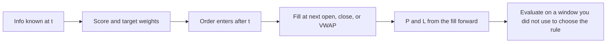

# Backtest design
{: .no_toc }

*~9 min read*

**🎯 Interview frequent**

## Why it matters

A backtest is an experiment. Interviewers ask when you knew the signal, when the order went out, what rules turned scores into weights, and which years you promised not to peek at. "We used Python and got Sharpe 1.5" is not a design. Design is what makes the number in [Backtest pitfalls](../07-backtest-pitfalls/) either evidence or fiction.

## Core concepts

- **Separate decision time from fill time.** Information timestamp t (close, or the filing time) produces a target. The fill happens later, at a price you can name: next open, next close, or VWAP over the next window. Filling at the same close that entered the signal is lookahead. Write the lag in the first paragraph of the result.
- **The portfolio rule is part of the experiment.** Dollar neutral, beta neutral, sector caps, max name weight, gross exposure, and a turnover limit change the strategy. If those knobs were turned after seeing P&L, you ran many experiments. Freeze a simple rule first. See [Portfolio construction](../09-portfolio-construction/).
- **Costs are an input.** Commission, spread, and a slippage or participation assumption belong in the base case if you will claim the strategy is tradable. A zero-cost run is a research diagnostic. Label it as gross. See [Execution & TCA](../11-execution-tca/).
- **One honest split beats five informal ones.** A minimal design: an in-sample window where you may explore, a validation window for a small number of predeclared choices, and a final holdout you touch once. Walking forward (refit on an expanding or rolling past, test on the next block) matches how a live process would work. It does not forgive trying twenty features and keeping the pretty path.
- **The holdout is burned when you look.** Adjusting a threshold because the holdout "almost worked" makes the holdout in-sample. If you must change the idea, say the confirmation is gone and collect a new period or accept a weaker claim.
- **Refit schedule is a parameter.** Estimating betas, z-score scales, or a combiner once on the full sample leaks. Estimate them only with data available at t, and update on a schedule you wrote down (monthly, yearly). Instability of those estimates is a reason the schedule matters.
- **Report a path, not a single Sharpe.** By year, gross and net, turnover, average gross exposure, max drawdown, hit rate, and factor loadings from [Factor models](../04-factor-models/). A Sharpe with no sample length, no frequency, and no cost assumption is not interpretable. Annualized Sharpe is not a t-stat. See [Statistical significance](../08-statistical-significance-multiple-testing/).
- **State the universe and the return convention in the same place as the result.** Members as of t, total return, delistings included. If those are vague, the design is not done. See [Data hygiene](../02-data-hygiene-survivorship/).

## Mental model

Read every backtest as a timeline. If you cannot place "signal," "order," and "fill" on it, you cannot trust the curve.

## Interview questions

1. **You build a signal from today's close and assume you trade at today's close. What do you change, and what happens to most short-horizon results when you change it?**
   Answer: Lag the fill to the next tradable price (next open or next close) and state which. Same-bar fills let the signal trade on information embedded in the price it "earns." Short-horizon Sharpes usually fall, sometimes through zero. If they do not, still keep the lag.

2. **How do you use three years of data without pretending the last year was unknown?**
   Answer: Freeze the hypothesis and the portfolio rule before looking at the last year, or use a walk-forward where each test block is predicted only with prior data. If the last year was used to pick the feature, it is not out of sample. Say that plainly.

3. **What belongs in the default performance table, beyond annualized Sharpe?**
   Answer: Sample range and return frequency, gross and net of a stated cost, turnover, exposure, max drawdown, a by-year split, and factor loadings or a hedged residual. Hit rate is optional and easy to game with position sizing. Sharpe alone hides all of that.

4. **Your model refits a regression every day using all history including the future relative to early dates, then simulates from the start. What's the bug?**
   Answer: Full-sample coefficients are a form of lookahead: early "predictions" use later observations. Coefficients at t may use only data through t. A single full-sample fit is descriptive. It is not a backtest.

5. **When is a walk-forward test still overfit?**
   Answer: When the thing you walk forward was chosen from a large search (features, windows, thresholds) and you only walk the winner. The walk-forward evaluates that specification. It does not undo the selection. Count the trials, or lock the spec before the walk. See [Backtest pitfalls](../07-backtest-pitfalls/).

## Watch

- [Quantopian Lecture Series: Dangers of Model Misspecification](https://www.youtube.com/watch?v=t4peS8Ak-sY) — Quantopian. What goes wrong when the backtest's assumptions don't match the data you claim to trade.
- [Quantopian Lecture Series: Instability of Regression Coefficients](https://www.youtube.com/watch?v=HMQ34PfhzGE) — Quantopian. Why a fit from one window is a weak thing to freeze for the whole history.

## Further reading

- López de Prado, *Advances in Financial Machine Learning* (Wiley, 2018) — chapters on backtest overfitting and how research design fails in finance. Cite the book; don't rely on a blog recap of it.
- Harvey and Liu, "Backtesting," *Journal of Portfolio Management*. [Author PDF](https://people.duke.edu/~charvey/Research/Published_Papers/P120_Backtesting.PDF). How to think about a reported Sharpe once many strategies have been tried.
