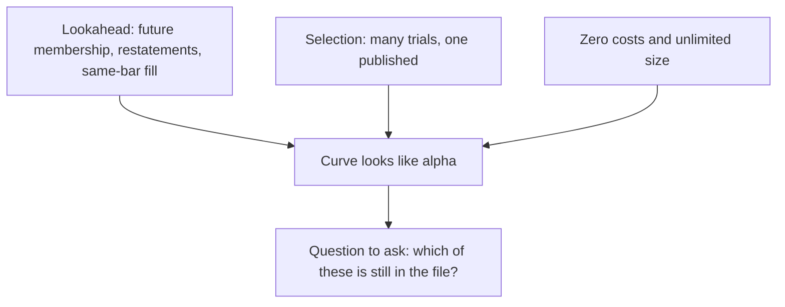

# Backtest pitfalls
{: .no_toc }

*~9 min read*

**🎯 Interview frequent**

## Why it matters

This is the page interviewers are actually grading. A candidate who can list lookahead, survivorship, overfitting, and costs — and can point at which one a given chart is guilty of — is ahead of a candidate who can recite Sharpe's formula. The pitfalls are not exotic. They are ordinary ways a simulation sees a future that the trader would not have.

## Core concepts

- **Lookahead / leakage.** Any input that was not knowable at decision time: future index membership, restated fundamentals, full-sample z-scores, a scaler fit on the test set, or a label built from a future return that then leaks into a feature. If the feature is a function of the thing you are predicting, the backtest is circular.
- **Same-bar execution.** Observing the close and trading the close, or observing a daily bar's high and selling it. The fix is a lag, not a story about liquidity. Tucker Balch's "observe the close and trade the close" is this bug.
- **Survivorship and delistings.** Covered in [Data hygiene](../02-data-hygiene-survivorship/). Still a pitfall when the backtest "looks equity-only" and the universe is today's names.
- **In-sample tinkering.** Change a window, a cutoff, a sector exclude, or a stop because the curve improved, and you have fit the sample. The final chart is the maximum over a search, not the result of a single test. Out-of-sample only counts if that search did not see it.
- **Overfit is the selection, not the vocabulary.** A simple two-parameter rule tried 200 ways overfits. A complicated model tried once can be cleaner. Complexity makes overfitting easier. The trial count is the problem interviewers want named. See [Multiple testing](../08-statistical-significance-multiple-testing/).
- **Costs and capacity.** Zero commission, zero spread, and unlimited size in a name that trades $1M a day will print money on paper. A constant 5 bps haircut is better than nothing and still not a capacity study. If the gross edge is the same order of magnitude as the spread, assume the net is fragile until shown otherwise.
- **Overlapping samples and inflated t-stats.** Rebalanced monthly using a 12-month label, with a t-stat that assumes independent months, overstates significance. The pitfall is reporting the unadjusted t-stat as if it were a sample of independent bets.
- **Regime luck and one path.** A strategy that is short volatility through a quiet decade can look skilled. Show the path by year and through a stress window you did not delete. One historical path is still one path.
- **The backtest did not include your own impact.** Historical prices are the world without your orders. For small size that is fine. For size that is a large fraction of volume, the fill in the simulation is a fantasy.

## Mental model

Treat a surprising Sharpe as a bug report. Your job is to find the bug before the interviewer does.

## Interview questions

1. **A daily mean-reversion backtest buys the close when the close is down and exits at that same close if you are already in. Why is the result not tradable, even before costs?**
   Answer: The decision uses the close, and the fill is that same close, so the trade earns a price that was the input to the decision. Shift execution to the next bar. Also check that "down" is computed from information available before the order.

2. **You tried 40 thresholds on the full sample and the best Sharpe is 1.8. What is the right description of 1.8?**
   Answer: It is the maximum of 40 in-sample looks, so it is biased high relative to a single predeclared rule. It is not an unbiased estimate of live performance. Either evaluate a threshold chosen without those looks, or raise the hurdle for the fact of 40 trials. See [Statistical significance](../08-statistical-significance-multiple-testing/).

3. **Name three distinct leakage paths that are not "using tomorrow's return as today's feature" in the obvious sense.**
   Answer: Universe defined with future membership or future survival; fundamental fields that were restated after the trade date; scaling, winsor limits, or regression coefficients estimated on the full sample including the test window. Same-bar fills are a fourth if you want execution leakage.

4. **The author says costs don't matter because the strategy trades liquid mega caps. What do you still want to see?**
   Answer: Turnover and an explicit cost in bps, because mega-cap spreads are small but not zero and high turnover still adds up. Also participation versus ADV on rebalance days, and whether the edge per trade is larger than the assumed spread. "Liquid" is not a cost model.

5. **A market-neutral backtest is flat in 2008 and 2020 and makes all of its money in one calm five-year block. How do you talk about it?**
   Answer: The full-sample Sharpe is a blend of one friendly regime and two dead ones. That can be honest (the mechanism is a quiet-market premium) or lucky. Report the subperiods, and don't drop the stress years from the headline number. If the mechanism should have worked in the stress, the flat years are evidence against it.

## Watch

- ["10 Ways Backtests Lie" by Tucker Balch](https://www.youtube.com/watch?v=wQrQwuWQ1FI) — Quantopian, QuantCon NYC 2015. In-sample testing, survivor bias, trading the close, impact, size, and data mining, in one talk.
- [Quantopian Lecture Series: Overfitting](https://www.youtube.com/watch?v=KNCgvjyKrcw) — Quantopian. Overfitting as a research failure mode, with the lecture's examples.
- [Dangers of Backtest Overfitting](https://www.youtube.com/watch?v=QxhxLwNbMMg) — Marcos López de Prado. Why repeated backtests manufacture Sharpe ratios, and what to keep track of.

## Further reading

- Bailey, Borwein, López de Prado, and Zhu, "The Probability of Backtest Overfitting." [SSRN 2326253](https://papers.ssrn.com/sol3/papers.cfm?abstract_id=2326253).
- Bailey and López de Prado, "The Deflated Sharpe Ratio." [SSRN 2460551](https://papers.ssrn.com/sol3/papers.cfm?abstract_id=2460551).
- Harvey and Liu, "Backtesting." [Author PDF](https://people.duke.edu/~charvey/Research/Published_Papers/P120_Backtesting.PDF).
